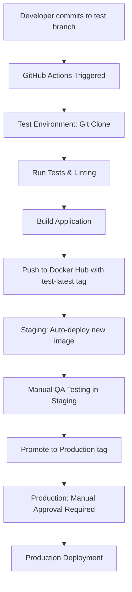

# CI/CD Pipeline Documentation

## Overview

This project implements a comprehensive CI/CD pipeline with four distinct environments, each serving a specific purpose in the software delivery lifecycle.

## Environments & Ports

| Environment | Port | Purpose | Deployment Strategy |
|-------------|------|---------|-------------------|
| **Development** | 18091 | Local development with hot-reload | Code mounting from local filesystem |
| **Test** | 18092 | Automated testing and Docker Hub publishing | Git-based builds from test branch |
| **Staging** | 18093 | Pre-production testing | Auto-deployment from test images |
| **Production** | 18090 | Live production system | Manual approval for prod-labeled images |

## Pipeline Flow



## Detailed Environment Configurations

### 1. Development Environment (`docker-compose.dev.yml`)
- **Purpose**: Local development with hot-reload
- **Code Strategy**: Volume mounting from local filesystem
- **Port**: 18091
- **Features**:
  - Live code changes reflected immediately
  - Development dependencies included
  - Debug mode enabled
  - File watching for automatic rebuilds

```bash
# Start development
./deploy.sh dev up

# Access application
http://localhost:18091
```

### 2. Test Environment (`docker-compose.test.yml`)
- **Purpose**: Automated testing and Docker image publishing
- **Code Strategy**: Git clone from test branch
- **Port**: 18092
- **Pipeline**:
  1. **git-clone**: Pulls latest code from test branch
  2. **test-runner**: Runs tests, linting, type-checking
  3. **app-builder**: Builds production-ready application
  4. **app**: Creates production container
  5. **docker-publisher**: Publishes to Docker Hub with `test-latest` tag

```bash
# Run full test pipeline
./deploy.sh test up

# This will:
# - Clone from git test branch
# - Run all tests and quality checks  
# - Build production image
# - Publish to Docker Hub if tests pass
```

### 3. Staging Environment (`docker-compose.staging.yml`)
- **Purpose**: Pre-production testing and validation
- **Code Strategy**: Auto-deployment from Docker Hub `test-latest` images
- **Port**: 18093
- **Features**:
  - **image-watcher**: Monitors Docker Hub for new `test-latest` images
  - **Auto-deployment**: Automatically pulls and deploys new images
  - **Webhook notifications**: Notifies external systems of deployments
  - **Health checks**: Ensures application is running correctly

```bash
# Start staging with auto-deployment
./deploy.sh staging up

# Monitor for auto-deployments
./deploy.sh staging logs
```

### 4. Production Environment (`docker-compose.prod.yml`)
- **Purpose**: Live production system
- **Code Strategy**: Manual deployment of prod-labeled images
- **Port**: 18090
- **Features**:
  - **prod-image-watcher**: Monitors for `prod` tagged images
  - **Manual approval**: Requires explicit approval for deployments
  - **Slack notifications**: Alerts team when deployment is ready
  - **High availability**: Multiple replicas and health checks
  - **Resource limits**: Production-tuned resource allocation

```bash
# Start production environment
./deploy.sh prod up

# Promote staging image to production
./deploy.sh prod promote
```

## Environment Variables

### Required Secrets
```bash
# Docker Hub credentials
DOCKER_USERNAME=your-dockerhub-username
DOCKER_PASSWORD=your-dockerhub-token

# Git access (if private repo)
GIT_TOKEN=your-github-token

# Notifications
SLACK_WEBHOOK=your-slack-webhook-url

# Production monitoring
SENTRY_DSN=your-sentry-dsn
```

### Configuration Files
- `.env.ci` - CI/CD pipeline configuration
- `.env.development` - Development environment
- `.env.test` - Test environment
- `.env.staging` - Staging environment  
- `.env.production` - Production environment

## Deployment Commands

### Quick Start
```bash
# Make script executable
chmod +x deploy.sh

# Start development
./deploy.sh dev up

# Run tests and publish
./deploy.sh test up

# Start staging auto-deployment
./deploy.sh staging up

# Start production (manual approval)
./deploy.sh prod up
```

### Management Commands
```bash
# Check status
./deploy.sh [env] status

# View logs
./deploy.sh [env] logs

# Restart environment
./deploy.sh [env] restart

# Stop environment
./deploy.sh [env] down

# Clean up (removes volumes)
./deploy.sh [env] clean

# Force rebuild
./deploy.sh [env] build
```

## GitHub Actions Integration

The pipeline integrates with GitHub Actions for automated CI/CD:

### Triggers
- **Push to test branch**: Runs full test pipeline and publishes to Docker Hub
- **Push to main branch**: Promotes tested image to production tag
- **Pull requests**: Runs security scans and quality checks

### Workflow Files
- `.github/workflows/cd-pipeline.yml` - Main CI/CD pipeline
- `.github/workflows/ci.yml` - Code quality checks
- `.github/workflows/codeql.yml` - Security analysis

## Image Tagging Strategy

### Test Environment
- `test-latest` - Latest successful test build
- `test-{BUILD_ID}` - Specific build number

### Production Environment  
- `prod` - Current production version
- `prod-{BUILD_ID}` - Specific production release

## Monitoring and Notifications

### Staging Auto-Deployment
- Monitors Docker Hub every 5 minutes
- Compares image IDs to detect new versions
- Automatically pulls and deploys new images
- Sends webhook notifications on deployment

### Production Approval
- Monitors Docker Hub every 10 minutes
- Detects new prod-tagged images
- Sends Slack notifications for approval
- Requires manual deployment command

## Security Features

- **Non-root containers**: All applications run as non-root users
- **Resource limits**: CPU and memory constraints
- **Network isolation**: Internal Docker networks
- **Secret management**: Environment-based secret injection
- **Image scanning**: Trivy security scans in CI
- **Encrypted networks**: Production uses encrypted overlay networks

## Troubleshooting

### Common Issues

1. **Port conflicts**: Ensure ports 18090-18093 are available
2. **Docker Hub authentication**: Verify DOCKER_USERNAME and DOCKER_PASSWORD
3. **Git access**: For private repos, set GIT_TOKEN
4. **Resource limits**: Increase Docker resource allocation if builds fail

### Debug Commands
```bash
# Check Docker system
docker system info

# View container logs
docker logs [container-name]

# Inspect images
docker images | grep filename-generator

# Check network connectivity
docker network ls
```

## Best Practices

1. **Branch Strategy**: Use test branch for features, main for releases
2. **Testing**: All code must pass tests before staging deployment
3. **Staging Validation**: Thoroughly test in staging before production
4. **Production Approval**: Always require manual approval for production
5. **Monitoring**: Set up alerts for deployment failures
6. **Rollback**: Keep previous images tagged for quick rollback

## Support

For issues with the CI/CD pipeline:
1. Check container logs: `./deploy.sh [env] logs`
2. Verify environment variables in `.env.ci`
3. Ensure Docker Hub credentials are correct
4. Check GitHub Actions workflow status